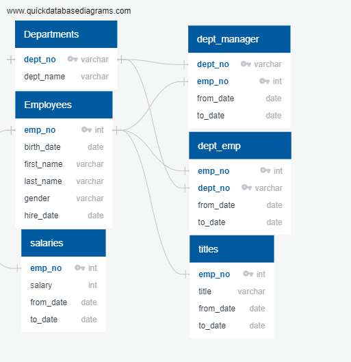
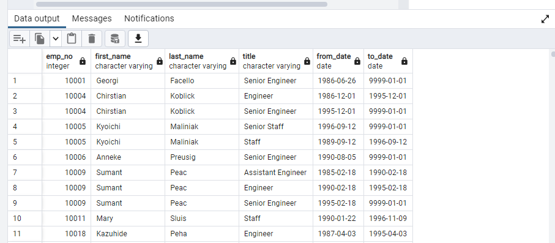
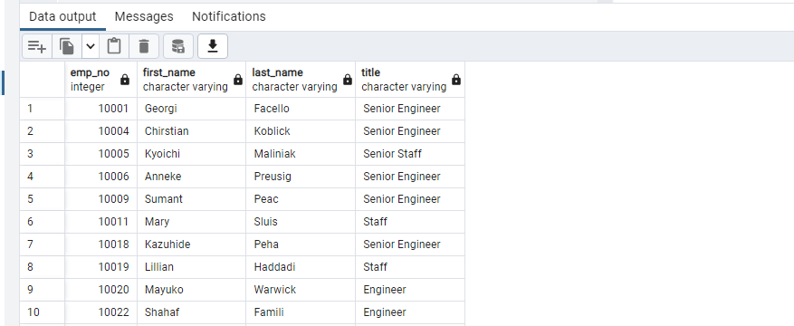
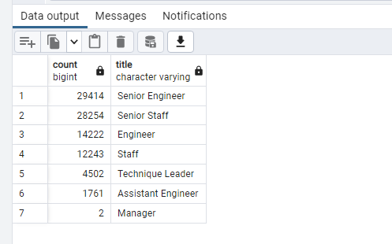

# **Pewlett-Hackard-Analysis**

## **Overview of the analysis:**
Every large employers such as Pwelett-Hackard must prepare for outgoing retirees so they won’t be left short of man power and avoid production interruption which could be critical to companies overall future productivity. The purpose of the Pewlett-Hackard-Analysis is to determine how many employees are getting close to retire and how many out of them will be eligible for mentorship program. The mentorship program will allow eligible employees train newer employees. This program will need to be well planned so the company can fill in the position for the out-going employees. We are to retrieve these data from resources below, create tables and be able to present it to the management.The database will be build with SQL applying data engineering, modeling and analysis. 

## **Resources**
* **Data Source**: [employees.csv](Data/employees.csv), [Titles.csv](https://github.com/rpamintuan671/Pewlett-Hackard-Analysis/blob/276666358959c2bad7c02a70e1f938b8f43128a3/Data/titles.csv), [departments.csv](Data/departments.csv), [dept_managers.csv](Data/dept_manager.csv), [salaries.csv](Data/salaries.csv)
* **Relational Database Management System**: PostgreSQl, pgAdmin
* **Entity Relationship Diagram (ERD) Tool**: [Quick Database Diagram](https://www.quickdatabasediagrams.com/)

## **Employee Database ERD**
Below is a preview of tables that is on csv file show casing the relationship of each tables to one another. Foreign keys, data types and primary keys were identified for each columns.

## **Delivery 1: The Number of Retiring Employees by Title**
Retirement Tables was created that holds all the titles of employees who were born between January 1, 1952 and December 31, 1995. A block of codes was use for this outcome and a screenshot of the Retirement_titles table below. 

A Unique Titles table below was also created to provide updated current employees that are eligible for retirement. This table was in descending order by employee number followed by first, last name and current job title in the company.

The third table was created to count the number of retiring employees group by titles. There are total of 90,398 employees who are eligible to retire and majority of them have senior level position. 

## **Delivery 2: Create a Mentorship Eligibility table for current employees who were born between January 1, 1965 and December 31, 1965.**
This table will be utilize by upper level management to create a mentorship program which will help the transitions of outgoing employees.

